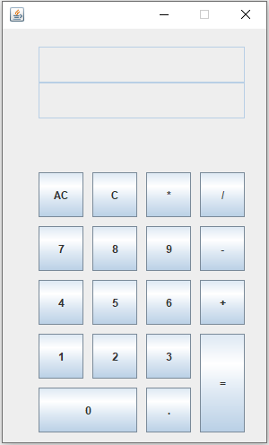
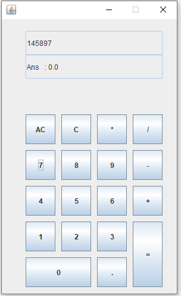

# Calculator-java
A simple calculator app in java. This project was made in 2018 when I started learning java.

## Project description
Name: Calculator  
Programming Language: Java  
GUI: javaSwing
Project No: 7  
Year: 2018

## Demo Video

## Screen shot
### Homescreen
 

 

## Authors

* **AbirHasan**

Check out my other works [@XAbirHasan](https://github.com/XAbirHasan)
